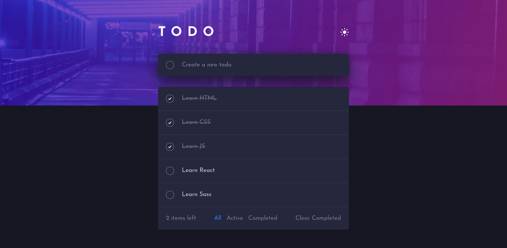
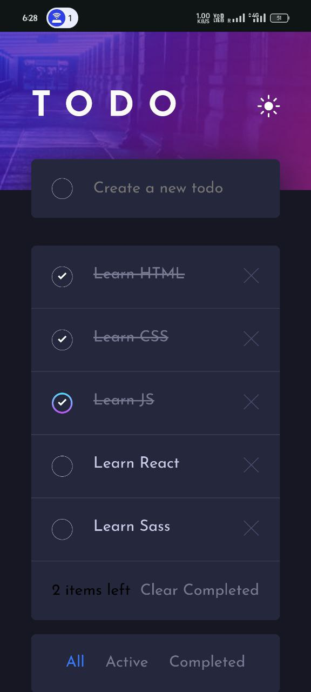

# Frontend Mentor - Todo app solution

This is a solution to the [Todo app challenge on Frontend Mentor](https://www.frontendmentor.io/challenges/todo-app-Su1_KokOW). Frontend Mentor challenges help you improve your coding skills by building realistic projects. 

## Table of contents

- [Overview](#overview)
  - [The challenge](#the-challenge)
  - [Screenshot](#screenshot)
  - [Links](#links)
- [My process](#my-process)
  - [Built with](#built-with)
  - [What I learned](#what-i-learned)
  - [Continued development](#continued-development)
  - [Useful resources](#useful-resources)
- [Author](#author)


**Note: Delete this note and update the table of contents based on what sections you keep.**

## Overview

### The challenge

Users should be able to:

- View the optimal layout for the app depending on their device's screen size
- See hover states for all interactive elements on the page
- Add new todos to the list
- Mark todos as complete
- Delete todos from the list
- Filter by all/active/complete todos
- Clear all completed todos
- Toggle light and dark mode

### Screenshot






### Links

- Solution URL: [Github](https://github.com/Subashkumar-S/ToDo-App)
- Live Site URL: [https://todo-app-26af6.web.app](https://todo-app-26af6.web.app)

## My process

### Built with

- Semantic HTML5 markup
- SCSS custom properties
- Mobile-first workflow
- [React](https://reactjs.org/) - JS library
- [Redux](https://redux.js.org/) - JS library


### What I learned

I have learned Redux by building this application. Here is my reducer function:

```js
import { createSlice } from "@reduxjs/toolkit";

export const VisibilityFilters = {
  ALL: "ALL",
  ACTIVE: "ACTIVE",
  COMPLETED: "COMPLETED",
};

const todoSlice = createSlice({
  name: "todo",
  initialState: {
    todos: [],
    visibilityFilter: VisibilityFilters.ALL,
    incompleteTasksCount: 0,
  },

  reducers: {
    addTodo: (state, action) => {
      state.todos.push({
        id: state.todos.length + 1,
        task: action.payload,
        isCompleted: false,
      });
      state.incompleteTasksCount++;
    },
    deleteTodo: (state, action) => {
      const index = state.todos.findIndex((todo) => todo.id === action.payload);
      if (index !== -1) {
        if (!state.todos[index].isCompleted) {
          state.incompleteTasksCount--; 
        }
        state.todos.splice(index, 1);
      }
    },
    toggleComplete: (state, action) => {
      const todo = state.todos.find((todo) => todo.id === action.payload);
      if (todo) {
        todo.isCompleted = !todo.isCompleted;
        if (todo.isCompleted) {
          state.incompleteTasksCount--; 
        } else {
          state.incompleteTasksCount++; 
        }
      }
    },
    setVisibilityFilter: (state, action) => {
      state.visibilityFilter = action.payload;
    },
    deleteCompletedTasks: (state) => {
      state.todos = state.todos.filter((todo) => !todo.isCompleted);
      state.incompleteTasksCount = state.todos.filter(
        (todo) => !todo.isCompleted
      ).length;
    },
  },
});

export const { addTodo, deleteTodo, toggleComplete, setVisibilityFilter, deleteCompletedTasks } =
  todoSlice.actions;

export default todoSlice.reducer;
```


### Continued development

To practice ReactJs and Redux more, helps me to continue focusing on in future projects.

### Useful resources

- [Redux Documentation](https://redux.js.org) - This helped me for understanding the core concepts of Redux.
- [Learn Redux](https://www.codecademy.com/learn/learn-redux) - This is an amazing course in CodeCademy which helped me finally understand Redux. I'd recommend it to anyone still learning this concept.


## Author

- Website - [Subashkumar S](https://subashkumar-s.web.app)
- Frontend Mentor - [@Subashkumar-S](https://www.frontendmentor.io/profile/Subashkumar-S)
- LinkedIn - [@subashkumar-s](https://www.linkedin.com/in/subashkumar-s)


